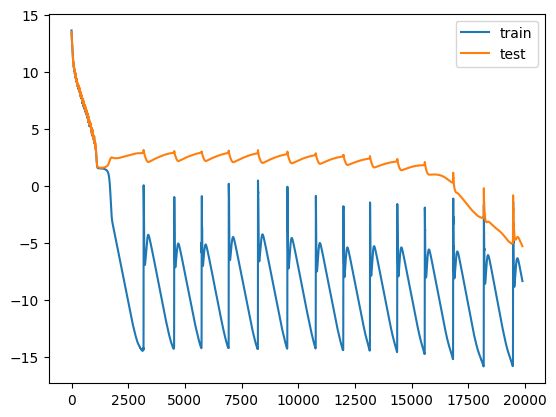

```bash
!python3 -m pip install git+https://github.com/tinygrad/tinygrad.git
```

```text
    Collecting git+https://github.com/tinygrad/tinygrad.git
      Cloning https://github.com/tinygrad/tinygrad.git to /tmp/pip-req-build-ug2m_50j
      Running command git clone --filter=blob:none --quiet https://github.com/tinygrad/tinygrad.git /tmp/pip-req-build-ug2m_50j
      Resolved https://github.com/tinygrad/tinygrad.git to commit f8a623b3863d9212b2ad76b79e3689c0182ab70b
      Preparing metadata (setup.py) ... [?25l[?25hdone
    Building wheels for collected packages: tinygrad
      Building wheel for tinygrad (setup.py) ... [?25l[?25hdone
      Created wheel for tinygrad: filename=tinygrad-0.9.2-py3-none-any.whl size=1042905 sha256=98446f548ad53faf744fa6f09c677b2893ce73f81928ba8fe4ed29e203b2e690
      Stored in directory: /tmp/pip-ephem-wheel-cache-aiwqkikf/wheels/86/f2/16/d5a5b26c57c97399f2a5776383dc8d69a9340af61421b55699
    Successfully built tinygrad
    Installing collected packages: tinygrad
    Successfully installed tinygrad-0.9.2
```


```python
from tinygrad import Tensor, dtypes, TinyJit
from tinygrad.nn.optim import AdamW
from tinygrad.nn.state import get_parameters
from tqdm import trange
from math import prod
import matplotlib.pyplot as plt
import numpy as np
```


```python
mod = 113
train_test_ratio = .3
ds_len = mod * mod
```


```python
# [[0,1,2,..,mod,0,1,2,...mod] mod times]
a = (
    Tensor.arange(mod, dtype=dtypes.int)
    .repeat((mod, 1))
    .flatten(0, -1)
    .unsqueeze(0)
)

# [[0,0,0,...,1,1,1,...,112,112,112] mod times]
b = (
    Tensor.arange(mod, dtype=dtypes.int)
    .unsqueeze(-1)
    .repeat((1, mod))
    .flatten(0, -1)
    .unsqueeze(0)
)

# [[113, 113, 113,...,113, 113] mod times]
equals = Tensor.full((ds_len), mod).unsqueeze(0)

# [[0+0, 1+0, 2+0, ..., 112+0], [0+1, 1+1, 2+1, ..., 112+112]]
sum = a + b
products = sum.div(mod).floor() * mod

# [[0, 1, 2, ..., 112], [1, 2, 3, ..., 113], ...]
targets = sum - products

ds = a.cat(b, equals, dim=0).T

indices = Tensor.randint(
    ds_len,
    low=0,
    high=ds_len,
)

ds_shuffled = ds[indices].cast(dtypes.float)
targets_shuffled = (
    targets[:, indices].cast(dtypes.float).reshape(prod(targets.shape), 1)
)

train_cutoff = int(train_test_ratio * ds_len)


x_train = ds_shuffled[:train_cutoff]
y_train = targets_shuffled[:train_cutoff]
x_test = ds_shuffled[train_cutoff:]
y_test = targets_shuffled[train_cutoff:]
```


```python
class TransformerBlock:
    def __init__(self, embed_dim, head_dim, num_heads):
        self.embed_dim = embed_dim
        self.head_dim = head_dim
        self.num_heads = num_heads

        self.q = Tensor.normal(embed_dim, embed_dim)
        self.k = Tensor.normal(embed_dim, embed_dim)
        self.v = Tensor.normal(embed_dim, embed_dim)

        self.head_out = Tensor.normal(num_heads * head_dim, embed_dim)

        self.ff1 = Tensor.normal(embed_dim, 4 * embed_dim)
        self.ff2 = Tensor.normal(4 * embed_dim, embed_dim)

    def attn(self, x):
        bsz = x.shape[0]
        q, k, v = [
            x.linear(proj)
            .reshape(bsz, -1, self.num_heads, self.head_dim)
            .transpose(1, 2)
            for proj in (self.q, self.k, self.v)
        ]
        return (
            q.scaled_dot_product_attention(k, v)
            .transpose(1, 2)
            .reshape(bsz, -1, self.num_heads * self.head_dim)
            .linear(self.head_out)
        )

    def mlp(self, x):
        return x.linear(self.ff1).relu().linear(self.ff2)

    def __call__(self, x):
        x = x + self.attn(x)
        x = x + self.mlp(x)
        return x


class GPT:
    def __init__(self, num_layers=1, embed_dim=128, vocab_size=113, context_length=3, num_heads=4):
        self.num_layers = num_layers
        self.embed_dim = embed_dim
        self.vocab_size = vocab_size
        self.context_length = context_length
        self.num_heads = num_heads

        self.tok_embed = Tensor.normal(vocab_size, embed_dim)
        self.pos_embed = Tensor.normal(context_length, embed_dim)

        self.blocks = [
            TransformerBlock(embed_dim, embed_dim // num_heads, num_heads)
            for _ in range(num_layers)
        ]

        self.out = Tensor.normal(embed_dim, vocab_size - 1)

    def __call__(self, x):
        # input shape (B,T,C)
        bsz = x.shape[0]
        pos = (
            Tensor.arange(self.context_length)
            .one_hot(self.context_length)
            .cast(dtypes.float)[: x.shape[1]]
            .expand((bsz, None, None))
        )
        x = x.one_hot(self.vocab_size).linear(self.tok_embed) + pos.linear(
            self.pos_embed
        )
        x = x.sequential(self.blocks)
        x = x.reshape(-1, x.shape[-1]).linear(self.out)
        return x.reshape((bsz, -1, x.shape[-1]))
```


```python
def loss_fn(logits: Tensor, labels):
    log_probs = logits.log_softmax(axis=-1).cast(dtypes.float64)
    correct = log_probs.gather(dim=-1, index=labels,)[:, 0]
    return -correct.mean()

def train(
    model,
    X_train,
    Y_train,
    X_test,
    Y_test,
    optim,
    steps=10000,  # Adjust this as per the actual training epochs needed
    lossfn=lambda out, y: out.sparse_categorical_crossentropy(y),
    allow_jit=True,
):
    def train_step(x, y):
        out = model(x)[:, -1]
        loss = lossfn(out, y)
        loss.backward()
        optim.step()
        optim.zero_grad()
        return loss.realize()

    def test_step(x, y):
        out = model(x)[:, -1]
        optim.zero_grad()
        loss = lossfn(out, y)
        return loss.realize()

    if allow_jit:
        train_step = TinyJit(train_step)

    train_losses = []
    test_losses = []
    with Tensor.train():
        for i in (t := trange(steps)):
            train_loss = train_step(X_train, Y_train)
            test_loss = test_step(X_test, Y_test)
            if test_loss.numpy() < 0.005:
              break
            train_losses.append(train_loss.numpy())
            test_losses.append(test_loss.numpy())

            t.set_description(
                f"train loss: {train_loss.numpy():.2f}, test loss: {test_loss.numpy():.2f}"
            )
    return train_losses, test_losses
```


```python
model = GPT()

optimizer = AdamW(get_parameters(model), lr=1e-3, b1=0.9, b2=0.98, weight_decay=1.0)

train_losses, test_losses = train(
        model,
        x_train,
        y_train,
        x_test,
        y_test,
        optimizer,
        steps=50000,
        lossfn=loss_fn,
)
```

    train loss: 0.00, test loss: 0.01:  40%|███▉      | 19885/50000 [15:16<23:08, 21.69it/s]


```python
plt.plot(np.log(train_losses), label="train")
plt.plot(np.log(test_losses), label="test")
plt.legend()
plt.show()
```

This is the famous loss curve (forgive me for the scale of y-axis). I believe the strange periodic behavior is due to numerical instability, but the 
idea is there -- we see that the train loss plummets quickly, while the test loss remains constant and only plummets
after tens of thousands of epochs of training.
    

    
```python
import pickle

with open('train.pkl', 'wb') as file:
    pickle.dump(train_losses, file)

with open('test.pkl', 'wb') as file:
    pickle.dump(test_losses, file)
```