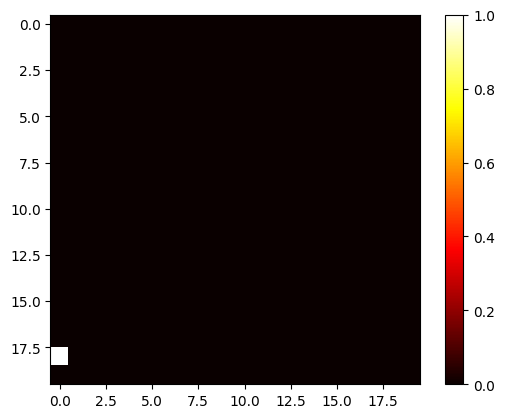
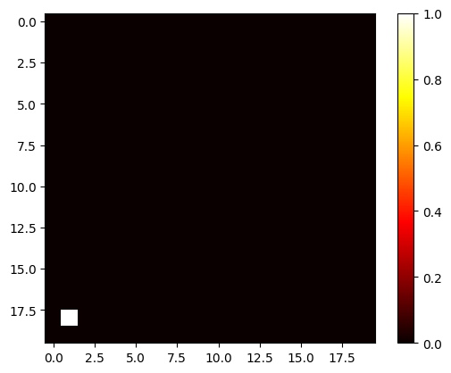
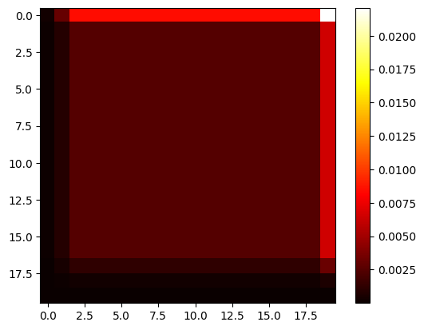
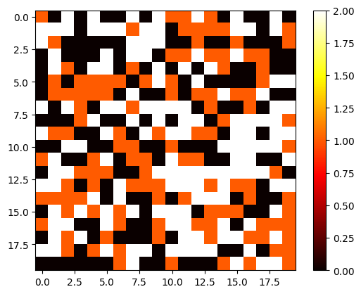
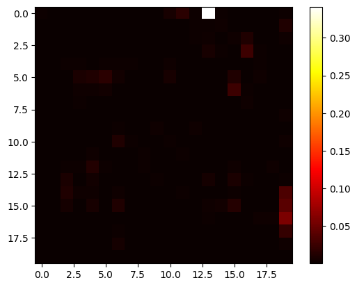

We start with a 20x20 grid with equal probabilities across every cell.

```python
import numpy as np

GRID_SIZE = 20*20
NUM_ROWS = NUM_COLS = 20

grid = np.full((NUM_ROWS, NUM_COLS), 1/GRID_SIZE, dtype=np.int64) 
```

And quickly a function to visualize this grid. I want (0,0) to be the bottom left in the visualization. Keep in mind this is actually the top left value in the `grid` matrix because this is how arrays are structured. I use `flipud` to orient it correctly in the visualization.


```python
import matplotlib.pyplot as plt

def plot_grid(grid):
    plt.imshow(np.flipud(grid), cmap='hot', interpolation='nearest')
    plt.colorbar()
state = (1, 0)
grid[state]=1
plot_grid(grid)
grid[state] = 1/GRID_SIZE
```


    

    


Now time to define a motion model. Our robot can take an action to move up, right, left, or down. It will succeed with probability .8. Keep in mind t


```python
actions = {
    "UP": (1, 0),
    "DOWN": (-1, 0),
    "LEFT": (0, -1),
    "RIGHT": (0, 1)
}

def add_action(state: tuple[int, int], action:str):
    return (state[0] + actions[action][0], state[1] + actions[action][1])

grid[add_action(state, "RIGHT")]=1
plot_grid(grid)
```


    

    


Now let's imagine we're given a list of actions:


```python
def run_motion_model(actions_list):
    prior = np.full((NUM_ROWS, NUM_COLS), 1/GRID_SIZE)
    is_valid = lambda state: 0 <= state[0] < NUM_ROWS and 0 <= state[1] < NUM_COLS

    for action in actions_list:
        posterior = np.zeros((NUM_ROWS, NUM_COLS))
        for y in range(NUM_ROWS):
            for x in range(NUM_COLS):
                prev_state = (y, x)
                state = add_action(prev_state, action)
                if is_valid(state):
                    posterior[state] += prior[prev_state] * 0.8
                    posterior[prev_state] += prior[prev_state] * 0.2
                else:
                    posterior[prev_state] += prior[prev_state]
        
        prior = posterior / np.sum(posterior)

    return prior
```


```python
actions_list = ["UP", "UP", "RIGHT", "RIGHT", "UP"]
final_posterior = run_motion_model(actions_list)
plot_grid(final_posterior)
```


    

    


Now what if each grid is one of three colors?


```python
from enum import Enum

def plot_color_grid(grid):
    plt.imshow(np.flipud(grid), cmap='hot', interpolation='nearest')
    plt.colorbar()

plot_color_grid(color_grid := np.random.randint(0, 3, size=(NUM_ROWS, NUM_COLS)))
color_grid.shape
```


    (20, 20)


    

    


Sensor predicts color with accuracy .7.


```python
actions_list = ["UP", "UP", "RIGHT", "RIGHT", "UP"]
observation_list = [0, 1, 2, 0, 1]

def run_color_motion_model(observation_list, actions_list, sensor_accuracy=.7):
    prior = np.full((NUM_ROWS, NUM_COLS), 1/GRID_SIZE)
    is_valid = lambda state: 0 <= state[0] < NUM_ROWS and 0 <= state[1] < NUM_COLS

    for observation, action in zip(observation_list, actions_list):
        posterior = np.zeros((NUM_ROWS, NUM_COLS))
        for y in range(NUM_ROWS):
            for x in range(NUM_COLS):
                prev_state = (y, x)
                state = add_action((y, x), action)
                if is_valid(state):
                    posterior[state] += prior[prev_state] * 0.8
                    posterior[prev_state] += prior[prev_state] * 0.2
                else:
                    posterior[prev_state] += prior[prev_state]
        sensor_model = np.where(observation == color_grid, sensor_accuracy, 1-sensor_accuracy)
        prior = sensor_model * posterior / np.sum(sensor_model * posterior)

    return prior

```


```python
final_posterior = run_color_motion_model(observation_list, actions_list, .5)
plot_grid(final_posterior)
```


    

    


Looks very similar to the motion only model with the same action sequence! They're actually the same with an accuracy of .5! 


```python
actions_list = ["UP", "UP", "RIGHT", "RIGHT", "UP"]
final_posterior_motion_only = run_motion_model(actions_list)

observation_list = [1, 1, 2, 1, 1]

final_posterior_color_too = run_color_motion_model(observation_list, actions_list, .5)
np.allclose(final_posterior_motion_only, final_posterior_color_too)
```


    True


Coming back to our original Bayes Filter equation derived in a previous post.

$$
\begin{align*}
P(X_t=x|u_{1:t},z_{1:t})=\frac{\text{sensor}(z_t, x) \sum_{x'}\text{motion}(x,x')\text{bel}_{t-1}(x')}{\sum_{x''} \text{sensor}(z_t,x'')\sum_{x'''}\text{motion}(x'',x''')\text{bel}_{t-1}(x''')\\}
\end{align*}
$$

If we know the probability will always be $.5$:

$$
\begin{align*}
P(X_t=x|u_{1:t},z_{1:t})=\frac{.5 \times \sum_{x'}\text{motion}(x,x')\text{bel}_{t-1}(x')}{\sum_{x''} .5 \times \sum_{x'''}\text{motion}(x'',x''')\text{bel}_{t-1}(x''')\\}\\
=\frac{.5 \times \sum_{x'}\text{motion}(x,x')\text{bel}_{t-1}(x')}{.5 \times \sum_{x''} \sum_{x'''}\text{motion}(x'',x''')\text{bel}_{t-1}(x''')\\}\\
=\frac{\sum_{x'}\text{motion}(x,x')\text{bel}_{t-1}(x')}{\sum_{x''} \sum_{x'''}\text{motion}(x'',x''')\text{bel}_{t-1}(x''')\\}\\
\end{align*}
$$

So it's just exactly the motion model.

Now what if our sensor is REALLY good?


```python
actions_list = ["UP", "UP", "RIGHT", "RIGHT", "UP"]
observation_list = [1, 1, 2, 1, 1]

final_posterior_color_too = run_color_motion_model(observation_list, actions_list, .9)
plot_grid(final_posterior_color_too)
```


    

    
Hopefully this gives some intuition. It did for me!