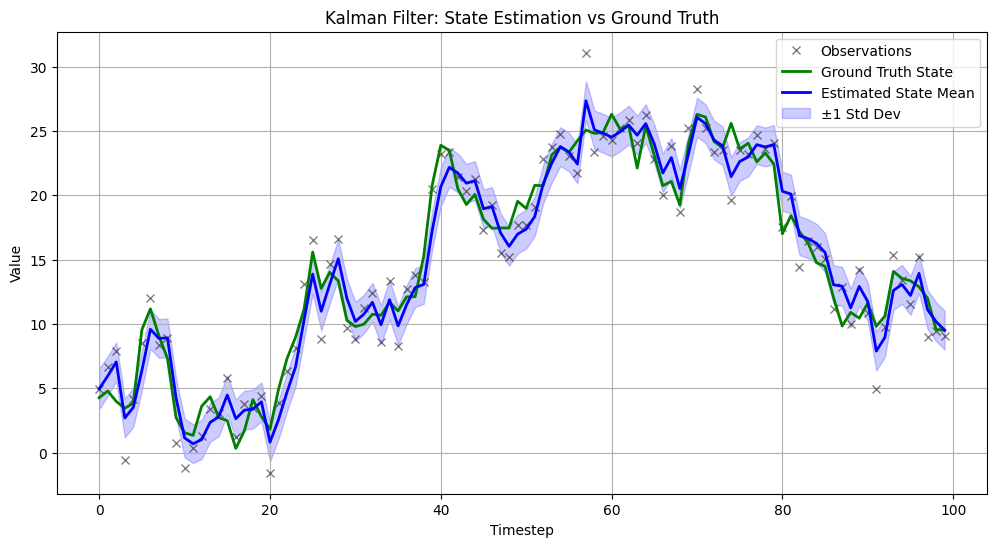

# Single Variable

First, need a way of generating observations from the noisy hidden state -- I will assume the state and observation dynamics are linear, and there is no control input:

$$
x_k=-x_{k-1}+\epsilon
$$

with $\epsilon \in N(0,1)$

$$
y_k = 2x_k+\beta
$$

with $\beta \in N(0, 2)$.


```python
import numpy as np
import matplotlib.pyplot as plt

# Generate observations and ground truth together

TIMESTEPS = 100
INITIAL_MEAN = 5
INITIAL_VARIANCE = 4
OBSERVATION_STD = 2
OBSERVATION_VARIANCE = OBSERVATION_STD ** 2
PROPAGATION_VARIANCE = 3

def prop_state(prev_state):
    return prev_state + np.random.normal(0, PROPAGATION_VARIANCE ** .5)

def gen_obs(state):
    return state + np.random.normal(0, OBSERVATION_STD)

# Initial state
ground_truth_states = [np.random.normal(INITIAL_MEAN, np.sqrt(INITIAL_VARIANCE))]
obs = []

# Generate states and corresponding observations
for _ in range(TIMESTEPS):
    next_state = prop_state(ground_truth_states[-1])
    ground_truth_states.append(next_state)
    obs.append(gen_obs(next_state))

def prop_mean(prev_mean):
    return prev_mean

def propagate_var(prev_var):
    return prev_var + PROPAGATION_VARIANCE

def propagate(prev_mean, prev_var):
    new_mean = prop_mean(prev_mean)
    new_var = propagate_var(prev_var)
    return new_mean, new_var

def update(state_mean, state_var, obs, C=2, obs_var=OBSERVATION_VARIANCE):
    kalman_gain = (C * state_var) / (C**2 * state_var + obs_var)
    new_mean = state_mean + kalman_gain * (obs - C * state_mean)
    new_var = 1 / (1/state_var + C**2 / obs_var)
    return new_mean, new_var

means, vars = [INITIAL_MEAN], [INITIAL_VARIANCE]
state_mean, state_var = INITIAL_MEAN, INITIAL_VARIANCE

for i in range(TIMESTEPS):
    state_mean, state_var = propagate(state_mean, state_var)
    state_mean, state_var = update(state_mean, state_var, obs[i], C=1)
    means.append(state_mean)
    vars.append(state_var)

plt.figure(figsize=(12, 6))
plt.plot(obs, 'kx', label='Observations', alpha=0.5)
plt.plot(ground_truth_states[1:], 'g-', label='Ground Truth State', linewidth=2)
plt.plot(means[1:], 'b-', label='Estimated State Mean', linewidth=2)

means_arr = np.array(means[1:])
std_devs = np.sqrt(vars[1:])
plt.fill_between(range(TIMESTEPS),
                 means_arr - std_devs,
                 means_arr + std_devs,
                 color='blue', alpha=0.2, label='±1 Std Dev')

plt.xlabel('Timestep')
plt.ylabel('Value')
plt.title('Kalman Filter: State Estimation vs Ground Truth')
plt.legend()
plt.grid(True)
plt.show()
```


    
