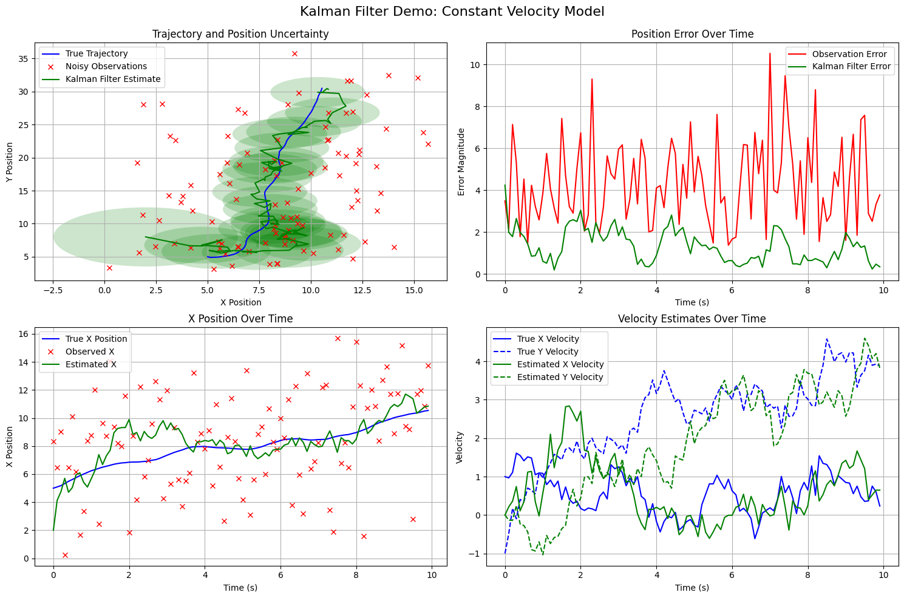

# Setup

- **Hidden State**: $x_t=\begin{bmatrix} x_t \\ y_t \\  v_{x_t} \\ v_{y_t} \end{bmatrix}$
- **Observation Model (position only)**: $y_t = \begin{bmatrix} x_t \\ y_t \end{bmatrix}$

# State Dynamics Model (constant velocity)

$$
x_{t+1}=Ax_t+\epsilon=\begin{bmatrix} 1 & 0 & \Delta t & 0 \\ 0 & 1 & 0 & \Delta t \\ 0 & 0 & 0 & 0 \\ 0 & 0 & 0 & 0 \end{bmatrix}x_t+\epsilon
$$

where $\epsilon \sim \mathcal{N}(1,\text{process covariance})$

# Observation Model

$$
y_t = Cx_t + \mathit{v} = \begin{bmatrix} 1 & 0 & 0 & 0 \\ 0 & 1 & 0 & 0 \end{bmatrix}x_t + \mathit{v}
$$

where $\mathit{v} \sim \mathcal{N}(1,\text{observation covariance})$

```python
import numpy as np
import matplotlib.pyplot as plt
from matplotlib.patches import Ellipse
import matplotlib.transforms as transforms

# Set a fixed seed for reproducibility
# np.random.seed(42)

timesteps = 100  
dt = 0.1
total_time = np.arange(0, timesteps * dt, dt)

A = np.array([
    [1, 0, dt, 0],  
    [0, 1, 0, dt],  
    [0, 0, 1, 0],   
    [0, 0, 0, 1],   
])

C = np.array([
    [1, 0, 0, 0],  
    [0, 1, 0, 0],  
])

process_noise_scale = 1 
process_covariance = np.array([
    [dt**3/3, 0, dt**2/2, 0],
    [0, dt**3/3, 0, dt**2/2],
    [dt**2/2, 0, dt, 0],
    [0, dt**2/2, 0, dt],
]) * process_noise_scale

observation_noise_scale = 10.0 
observation_covariance = np.eye(2) * observation_noise_scale

def plot_covariance_ellipse(ax, x, y, covariance, color, alpha=0.3, n_std=1.0):
    pearson = covariance[0, 1]/np.sqrt(covariance[0, 0] * covariance[1, 1])
    ell_radius_x = np.sqrt(1 + pearson)
    ell_radius_y = np.sqrt(1 - pearson)
    ellipse = Ellipse((0, 0), width=ell_radius_x * 2, height=ell_radius_y * 2, 
                      facecolor=color, alpha=alpha)
    
    scale_x = np.sqrt(covariance[0, 0]) * n_std
    scale_y = np.sqrt(covariance[1, 1]) * n_std
    
    transform = transforms.Affine2D() \
        .rotate_deg(45) \
        .scale(scale_x, scale_y) \
        .translate(x, y)
    
    ellipse.set_transform(transform + ax.transData)
    return ax.add_patch(ellipse)

states = []
observations = []
state = np.array([5, 5, 1, -1])

for i in range(timesteps):
    states.append(state.copy())
    
    observation = np.dot(C, state) + np.random.multivariate_normal(np.zeros(2), observation_covariance)
    observations.append(observation)
    
    state = np.dot(A, state) + np.random.multivariate_normal(np.zeros(4), process_covariance)

states = np.vstack(states)
observations = np.vstack(observations)

kf_estimates = []
kf_covariances = []

mu = np.array([2, 8, 0, 0])  
covariance = np.eye(4) * 5.0

for i in range(timesteps):
    kf_estimates.append(mu.copy())
    kf_covariances.append(covariance.copy())
    
    # Prediction step
    mu = np.dot(A, mu)
    covariance = A @ covariance @ A.T + process_covariance
    
    # Update step
    S = C @ covariance @ C.T + observation_covariance
    K = covariance @ C.T @ np.linalg.inv(S)
    
    mu = mu + K @ (observations[i] - C @ mu)  
    covariance = (np.eye(4) - K @ C) @ covariance  

kf_estimates = np.vstack(kf_estimates)

fig = plt.figure(figsize=(15, 10))

ax1 = fig.add_subplot(221)
ax1.plot(states[:, 0], states[:, 1], 'b-', label='True Trajectory')
ax1.plot(observations[:, 0], observations[:, 1], 'rx', label='Noisy Observations')
ax1.plot(kf_estimates[:, 0], kf_estimates[:, 1], 'g-', label='Kalman Filter Estimate')

for i in range(0, timesteps, 4):
    cov_pos = np.array([[kf_covariances[i][0, 0], kf_covariances[i][0, 1]],
                         [kf_covariances[i][1, 0], kf_covariances[i][1, 1]]])
    plot_covariance_ellipse(ax1, kf_estimates[i, 0], kf_estimates[i, 1], 
                          cov_pos, 'g', alpha=0.2, n_std=2)

ax1.grid(True)
ax1.set_title('Trajectory and Position Uncertainty')
ax1.set_xlabel('X Position')
ax1.set_ylabel('Y Position')
ax1.legend()

ax2 = fig.add_subplot(222)
obs_errors = np.sqrt(np.sum((observations - states[:, :2])**2, axis=1))
kf_errors = np.sqrt(np.sum((kf_estimates[:, :2] - states[:, :2])**2, axis=1))

ax2.plot(total_time, obs_errors, 'r-', label='Observation Error')
ax2.plot(total_time, kf_errors, 'g-', label='Kalman Filter Error')
ax2.set_title('Position Error Over Time')
ax2.set_xlabel('Time (s)')
ax2.set_ylabel('Error Magnitude')
ax2.grid(True)
ax2.legend()

ax3 = fig.add_subplot(223)
ax3.plot(total_time, states[:, 0], 'b-', label='True X Position')
ax3.plot(total_time, observations[:, 0], 'rx', label='Observed X')
ax3.plot(total_time, kf_estimates[:, 0], 'g-', label='Estimated X')
ax3.set_title('X Position Over Time')
ax3.set_xlabel('Time (s)')
ax3.set_ylabel('X Position')
ax3.grid(True)
ax3.legend()

ax4 = fig.add_subplot(224)
ax4.plot(total_time, states[:, 2], 'b-', label='True X Velocity')
ax4.plot(total_time, states[:, 3], 'b--', label='True Y Velocity')
ax4.plot(total_time, kf_estimates[:, 2], 'g-', label='Estimated X Velocity')
ax4.plot(total_time, kf_estimates[:, 3], 'g--', label='Estimated Y Velocity')
ax4.set_title('Velocity Estimates Over Time')
ax4.set_xlabel('Time (s)')
ax4.set_ylabel('Velocity')
ax4.grid(True)
ax4.legend()

plt.tight_layout()
plt.suptitle('Kalman Filter Demo: Constant Velocity Model', fontsize=16)
plt.subplots_adjust(top=0.92)
plt.show()
```

