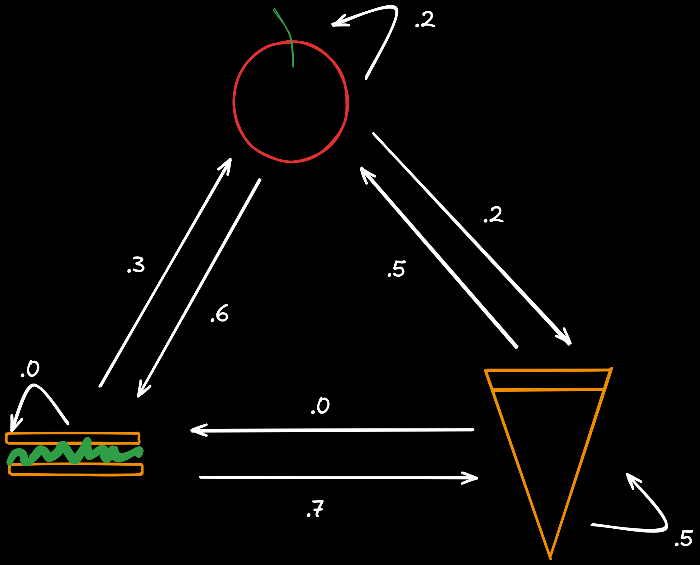
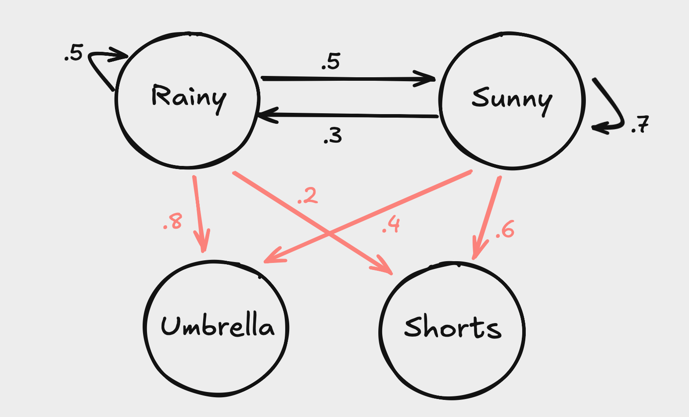

Important citations: This post began with me taking notes on a series of videos by "Normalized Nerd" on Markov Chains in an effort to better understand the content from my robotics class. I infused some of my own intuition and notation, but a lot of the content comes directly from these two sources. All credit to them.

# Markov Models

Say you have a restuarant which serves three foods: apples, sandwiches, and hamburgers. The food they serve on a particular day probabilistically depends on what was served the previous day. "Probabilistically" refers to the fact that, given we know what was served yesterday, we have a probability mass function of what was served today over the possible options. Observe a visual representation of such a system below:



Notice that the sum of the outgoing edges for any given state is 1. In the context of a particular transition from one state to the next (outgoing edges), the sample space of possible events is only the three other states ($P(\Omega)=1$). $\Omega = \{\text{apple}, \text{sandwich}, \text{pizza}\}$, or $\{A, S, P\}$ for short. I will denote the possible options for state with $x$ and the state at any particular time $t$ with $X_t$. 

## Markov Assumption

The defining property of markov systems is that the state of the system only depends on the previous state and nothing else. Look back at the graph above -- what other information could we possibly have or need? This is known as the *markov assumption* or *markov property*, and it can be demonstrated mathematically as follows:

$$
P(X_{t+1}=x_i | X_t=P)=P(X_{t+1}=x_i | X_1 = S, X_2 = A, \cdots, X_t = P)
$$

Now here's two thought-provoking questions: What would $P(A)$ mean in isolation? More generally, what about the pmf of $x$?

Obviously, this quantity represents the probability of being in any particular state, but it is a bit tricky to think about obtaining this value. While determining these values mathematically will require some more background, I can say right now that it refers to the *steady state probability*. After we've served food for a long time (or taken a random walk along the Markov chain with an infinite number of steps), we can divide the occurences of one food over the total number of steps to get the probability for each food.

Before solving for these values, allow me to introduce some more notation.


```python
import numpy as np

def random_walk(transition_matrix, start_state, n_steps):
    states = [start_state]
    current_state = start_state
    
    for _ in range(n_steps):
        current_state = np.random.choice(
            len(transition_matrix),
            p=transition_matrix[current_state]
        )
        states.append(current_state)
    
    unique, counts = np.unique(states, return_counts=True)
    pmf = np.zeros(len(transition_matrix))
    pmf[unique] = counts / len(states)
    
    return pmf
```


```python
P = np.array([
    [.2 , .6, .2],
    [.3, .0, .7],
    [.5, .0, .5]
])

random_walk(P, start_state=0, n_steps=1000000)
```


    array([0.35187765, 0.21147579, 0.43664656])


## Transition Matrix

A helpful way to represent the system is with a transition matrix:

$$
\begin{matrix} 
& \text{next state} & & \\
\text{current state} & 
\begin{pmatrix}
0.2 & 0.6 & 0.2 \\
0.3 & 0.0 & 0.7 \\
0.5 & 0.0 & 0.5
\end{pmatrix}
\end{matrix}
$$

Each row represents a particular current state $X_t$ and the values in that row are the probabilities of transitioning to that state in $X_{t+1}$. Let the first value be apple, second sandwich, and third pizza. $T_{ij}$ would refer to the probability of transitioning to state $x_j$ from $x_i$, or $P(X_{t+1}=x_j | X_t = x_i)$. Once again, notice how the rows sum to one as expected. I like to think of $T$ like this:

$$
\begin{matrix} 
\begin{pmatrix}
P(X_{t+1}=x_1|X_t=x_1) & P(X_{t+1}=x_2|X_t=x_1) & P(X_{t+1}=x_3|X_t=x_1) \\
P(X_{t+1}=x_1|X_t=x_2) & P(X_{t+1}=x_2|X_t=x_2) & P(X_{t+1}=x_3|X_t=x_2) \\
P(X_{t+1}=x_1|X_t=x_3) & P(X_{t+1}=x_2|X_t=x_3) & P(X_{t+1}=x_3|X_t=x_3)
\end{pmatrix}
\end{matrix}
$$

Next, let $\pi_t$ be a column vector which refers to the pmf of states at time $t$. 
$\pi_t = \begin{pmatrix}
P(X_t=A) \\ P(X_t=S) \\ P(X_t=P)
\end{pmatrix}$


Imagine that we start on apple, so $\pi_0=\begin{pmatrix}
1 \\ 0 \\ 0
\end{pmatrix}$. How could we find $\pi_1$? It's easier to start by determining $\pi_1^1$ (also denoted as $P(X_1=A)$) and then generalizing.

Applying the law of total probability: 

$$P(X_1=A)=P(X_1=A|X_0=A)P(X_0=A)+P(X_1=A|X_0=S)P(X_0=S)+P(X_1=A|X_0=P)P(X_0=P)$$
We know $P(X_0=x_i)$ from $\pi_0$ and $P(X_1=A|X_0=x_i)$ from the first column of $T$. Plugging in the values:

$$
P(X_1=A)=\pi_1^1=.2*1+.3*0+.5*0=.2
$$

Generalizing this formula to the other possible states for $t=1$:

$$
\begin{align*}
&P(X_1=x_i)=\pi_1^{i}\\
&=P(X_1=x_i|X_0=A)P(X_0=A)+P(X_1=x_i|X_0=S)P(X_0=S)+P(X_1=x_i|X_0=P)P(X_0=P)
\end{align*}
$$

$$
\pi_1=\begin{pmatrix}
P(X_1=x_1|X_0=x_1)P(X_0=x_1) + P(X_1=x_1|X_0=x_2)P(X_0=x_2) + P(X_1=x_1|X_0=x_3)P(X_0=x_3) \\
P(X_1=x_2|X_0=x_1)P(X_0=x_1) + P(X_1=x_2|X_0=x_2)P(X_0=x_2) + P(X_1=x_2|X_0=x_3)P(X_0=x_3) \\
P(X_1=x_3|X_0=x_1)P(X_0=x_1) + P(X_1=x_3|X_0=x_2)P(X_0=x_2) + P(X_1=x_3|X_0=x_3)P(X_0=x_3)
\end{pmatrix}
$$

This is equivalent to the following:

$$
\pi_1=\begin{pmatrix}
T_{11}\pi_0^1 + T_{21}\pi_0^2 + T_{31}\pi_0^3 \\
T_{12}\pi_0^1 + T_{22}\pi_0^2 + T_{32}\pi_0^3 \\
T_{13}\pi_0^1 + T_{23}\pi_0^2 + T_{33}\pi_0^3
\end{pmatrix}
$$

Notice that the i-th value is the dot product of the i-th column of $T$ with $\pi_0$. This looks a lot like matrix-vector multiplication, except matrix-vector multiplication takes the dot product of the i-th *row* with the vector. So, we can just transpose $T$ and multiply that with $\pi_0$ to get $\pi_1$!

$$
\pi_1 = T^\top\pi_0
$$

Therefore, to find the pmf of the system, calculate $\pi_\infin$. 


```python
import numpy as np

def steady_state(transition_matrix, start_state, n_steps):
    current_state = np.zeros(len(transition_matrix))
    current_state[start_state] = 1

    transition_matrix_T = transition_matrix.T
    
    for _ in range(n_steps):
        current_state = transition_matrix_T @ current_state
    
    return current_state.tolist()
```


```python
P = np.array([
    [.2 , .6, .2],
    [.3, .0, .7],
    [.5, .0, .5]
])

steady_state(P, start_state=0, n_steps=10000)
```


    [0.352112676056338, 0.21126760563380279, 0.43661971830985913]


Even better, we don't even need to use the recursive formula. Check this out:

$$\pi_\infin = T^\top\pi_\infin$$

The two vectors are actually the same. This is exactly the eigenvalue equation you're familiar with ($Av=\lambda v$). Therefore, we can immediately determine the steady state probability distribution of the markov system by finding the *left*-eigenvector of $T$ or the *right*-eigenvector of $T^\top$ for eigenvalue $1$.


```python
import numpy as np

def steady_state(transition_matrix):
    transition_matrix_T = transition_matrix.T
    eigenvalues, eigenvectors = np.linalg.eig(transition_matrix_T)
    
    # Find index of eigenvalue closest to 1
    stationary_idx = np.argmin(np.abs(eigenvalues - 1))
    
    # Get corresponding eigenvector and normalize
    stationary_dist = np.real(eigenvectors[:, stationary_idx])
    return (stationary_dist / np.sum(stationary_dist)).tolist()
```


```python
steady_state(P)
```


    [0.35211267605633817, 0.21126760563380279, 0.4366197183098591]


# Hidden Markov Models

In real world settings, we typically don't have the ability to directly measure the states we're interested in. Consider the problem of estimating the position of an autonomous car: we may receive odometry from SLAM, GPS, IMU, etc... but these measurements are noisy and do not truly reflect the state we want. The true position of the car is known as a *hidden state*, and the readings we get from our sensors and models are *observations*. A hidden markov model lets us use these readings to make predictions about the hidden state without direct access.

Imagine you are being held captive inside an office building with no windows. All day, you dream about the outside and desparetly want to know the weather (hidden state). The only weather-related information you have access to is the attire of the employees who come into the office every day. More specifically, you want to know if it's sunny or rainy based on if the employees bring umbrellas or are wearing shorts. Let $X$ be the hidden weather state where $X=0$ means it's rainy and $X=1$ means it's sunny. Let $Y$ be the observed state where $Y=0$ means people brought umbrellas and $Y=1$ means poeple are wearing shorts. 

The main idea is that, although we can't directly observe a hidden state, the observed state still gives us valuable information about the hidden state.



The arrows depicted in red correspond to condition probabilities of observed states based on hidden states. The probability that people bring umbrellas given that it's raining, or $P(Y=0 | X=0)$ is $.8$. The transition matrix is the same as before:

$$
\begin{pmatrix}
P(X_1=0 | X_0=0) && P(X_1=1 | X_0=0) \\ 
P(X_1=0 | X_0=1) && P(X_1=1 | X_0=1) \\ 
\end{pmatrix}
=
\begin{pmatrix}
.5 && .5 \\ 
.3 && .7 \\ 
\end{pmatrix}
$$

## Emission Matrix

We need a way to represent the conditional probabilities in matrix form. From now on, these condition probabilities will be known as *emission probabilties* and the corresponding matrix is the *emission matrix*:

$$
M=
\begin{pmatrix}
P(Y=0 | X=0) && P(Y=1 | X=0) \\ 
P(Y=0 | X=1) && P(Y=1 | X=1) \\ 
\end{pmatrix}
=
\begin{pmatrix}
.8 && .2 \\ 
.4 && .6 \\ 
\end{pmatrix}
$$

Keep in mind that this matrix doesn't have to be square. If we only wanted to estimate position based on three different sensors, our matrix would have 1 row and 3 columns.

HMMs allow us to solve a number of interesting problems in the real world.

1. Filtering: Given observations up to time $t$, compute the distribution of the state at time $t$:

$$
P(X_k | Y_1, \cdots, Y_k)
$$

2. Smoothing: Given observations up to time $t$, compute the distribution of the state at any time $k<t$:

$$
P(X_k | Y_1, \cdots, Y_k) \text{ for } k < t
$$

Notice that this problem cannot be solved online because we don't have access to future observations.

3. Prediction: Given observations up to time $t$, compute the distribution of the state at a time $j>t$:

$$
P(X_j | Y_1, \cdots, Y_k) \text{ for } j > k
$$

4. Decoding: Find the state trajectory $X_1, \cdots, X_k$ that maximizes the probability given observations $Y_1, \cdots, Y_k$:

$$
P(X_1, \cdots, X_k | Y_1, \cdots, Y_k)
$$

5. Likelihood of observations: Given the observation trajectory, $Y_1,\cdots,Y_k$, compute the probability:

$$
P(Y_1, \cdots, Y_k)
$$

The likelihood appears in the denominator of Bayes Rule when trying to calculate $P(X|Y)$.

Now, how might we determine $P(Y=Y_0,Y_0,Y_1|X=X_0,X_1,X_1)$? Recall that, under the markov assumption, events at different timesteps are independent. Therefore, the probability can be simplified to the following:

$$P(Y_1=0,Y_2=0,Y_3=1|X_1=0,X_2=1,X_3=1)=P(Y_1=0|X_1=0)*P(Y_2=0|X_2=1)*P(Y_3=1|X_3=1)$$

And these values come directly from the emission matrix:

$$P(Y_1=0|X_1=0)*P(Y_2=0|X_2=1)*P(Y_3=1|X_3=1)=M_{00}*M_{10}*M_{11}=.8*.4*.6=.192$$

What if we wanted to calculate $P(Y,X)$ in this scenario? We'd have to include the probability of observing that particular sequence of hidden states too:

$$
\begin{align*}
P(Y_1=0|X_1=0)*P(Y_2=0|X_2=1)*P(Y_3=1|X_3=1)\\
*P(X_1=0)*P(X_2=1|X_1=0)*P(X_3=1|X_2=1) = \\
M_{00}*M_{10}*M_{11} * \pi^{(0)}*T_{01}*T_{11}=.8*.4*.6*.375*.5*.5*.7=.0126
\end{align*}
$$

Recall that $P(X_0)$ comes from the steady state distribution of the hidden states, so we have to calculate that using the eigenvalue method.


```python
T = np.array([
    [.5, .5,],
    [.3, .7,],
])
random_walk(P)
```


    [0.35211267605633817, 0.21126760563380279, 0.4366197183098591]


Now, a slightly more difficult question: What is $P(Y_0, Y_0, Y_1)$? Computing this would require us to perform the computation above but for all possible sequences of $X$, which is $2^3$ (2 options, 3 positions). This is an application of the law of total probability.

$$ 
\begin{align*}
P(Y_1=0, Y_2=0, Y_3=1)=\\
P(X_1) P(Y_1=0|X_1) P(X_2|X_1) P(Y_2=0|X_2) P(X_3|X_2) P(Y_3=1|X_3) + \\
P(X_1) P(Y_1=0|X_1) P(X_2|X_1) P(Y_2=0|X_2) P(X_3|X_2) P(Y_3=1|X_3) + \\
P(X_1) P(Y_1=0|X_1) P(X_2|X_1) P(Y_2=0|X_2) P(X_3|X_2) P(Y_3=1|X_3) + \\
P(X_1) P(Y_1=0|X_1) P(X_2|X_1) P(Y_2=0|X_2) P(X_3|X_2) P(Y_3=1|X_3) + \\
P(X_1) P(Y_1=0|X_1) P(X_2|X_1) P(Y_2=0|X_2) P(X_3|X_2) P(Y_3=1|X_3) + \\
P(X_1) P(Y_1=0|X_1) P(X_2|X_1) P(Y_2=0|X_2) P(X_3|X_2) P(Y_3=1|X_3) \ \ \ 
\end{align*}
$$

Alternatively:

$$
P(Y=Y_0, Y_0, Y_1) = \sum_{X_0 \in \{0,1\}} \sum_{X_1 \in \{0,1\}} \sum_{X_2 \in \{0,1\}} P(Y_0|X_0) \cdot P(Y_0|X_1) \cdot P(Y_1|X_2) \cdot P(X_0) \cdot P(X_1|X_0) \cdot P(X_2|X_1)
$$

Now imagine the difficulty in computing this expression in real-time as the sequence length and number of states grows. It's intractable. Thankfully, we can take advantage of the fact that many values are being computed more than once. The forward algorithm defines a recurrence relation we can use as part of a memoization approach to avoid the repeated computations.

# Forward Algorithm

Imagine that we knew the value of $P(Y_1=0,Y_2=0,Y_3=1, X_3=0)$ and $P(Y_1=0,Y_2=0,Y_3=1, X_3=1)$. We could compute the likelihood for the sequence of observations $P(Y_1=0,Y_2=0,Y_3=1)$ by simply summing these values: 

$$
P(Y_1=0,Y_2=0,Y_3=1)=P(Y_1=0,Y_2=0,Y_3=1, X_3=0)+P(Y_1=0,Y_2=0,Y_3=1, X_3=1)
$$

Let $\alpha_t(x)=P(Y_1,Y_2,\cdots,Y_t, X_t=x)$. We can then find the likelihood with the following formula, where $x$ represents the possible hidden states.

$$
P(Y_1,\cdots,Y_t)=\sum_x\alpha_t(x)
$$

But how do we actually find $\alpha_t(x)$? This is where the recurrence comes in! For clarity, I'll first state the formula for a single timestep with the expanded version and then reintroduce alpha.


$$
\begin{align*}
P(Y_1=0,Y_2=0,Y_3=1, X_3=0) = \\
P(Y_1=0,Y_2=0,X_2=0)P(X_3=0|X_2=0)P(Y_3=1|X_3=0)\\
 + P(Y_1=0,Y_2=0,X_2=1)P(X_3=0|X_2=1)P(Y_3=1|X_3=0)
\end{align*}
$$

Now, in terms of $\alpha_3(0)$:

$$
\alpha_3(0) = 
\alpha_2(0)P(X_3=0|X_2=0)P(Y_3=1|X_3=0) + \alpha_2(1)P(X_3=0|X_2=1)P(Y_3=1|X_3=0)
$$

And if we wanted to find $P(Y_1=0,Y_2=0,Y_3=1, X_3=1)$ or $\alpha_3(1)$:

$$
\alpha_3(1) = 
\alpha_2(0)P(X_3=1|X_2=0)P(Y_3=1|X_3=1) + \alpha_2(1)P(X_3=1|X_2=1)P(Y_3=1|X_3=1)
$$

See how $\alpha_2(0)$ and $\alpha_2(1)$ reappear in both -- this is the key!

The base case of this recurrence relation is $\alpha_1(x)=P(X_1=x)P(Y_1|X_1=x)$.

Finally, here is the general formula for the recurrence relation (with both $x$ and $x'$ referring to hidden states):

$$
\alpha_t(X_t=x) = P(Y_t|X_t=x)\sum_{x'}\alpha_{t-1}(x')P(X_t=x|X_{t-1}=x') = M_{xY_t}\sum_{x'}\alpha_{t-1}(x')T_{x'x}
$$

Now I will carry out the forward algorithm of the HMM:


```python
def steady_state(transition_matrix):
    transition_matrix_T = transition_matrix.T
    eigenvalues, eigenvectors = np.linalg.eig(transition_matrix_T)
    stationary_idx = np.argmin(np.abs(eigenvalues - 1))
    stationary_dist = np.real(eigenvectors[:, stationary_idx])
    return stationary_dist / np.sum(stationary_dist)

T = np.array([[0.5, 0.5], [0.3, 0.7]])
M = np.array([[0.8, 0.2], [0.4, 0.6]])
pi = steady_state(T)
observations = [0, 0, 1]

n_hidden_states = len(T)

alphas = {'0': [], '1': []}

if observations:
    first_obs = observations[0]
    alphas['0'] = [pi[0] * M[0, first_obs]]
    alphas['1'] = [pi[1] * M[1, first_obs]]
    
    for t in range(1, len(observations)):
        current_obs = observations[t]
        new_alpha_0 = (alphas['0'][t-1] * T[0, 0] + alphas['1'][t-1] * T[1, 0]) * M[0, current_obs]
        new_alpha_1 = (alphas['0'][t-1] * T[0, 1] + alphas['1'][t-1] * T[1, 1]) * M[1, current_obs]
        alphas['0'].append(new_alpha_0)
        alphas['1'].append(new_alpha_1)

print("Alphas after correction:", sum([alpha[-1] for alpha in alphas.values()]))
```

    Alphas after correction: 0.13440000000000002


```python
import numpy as np

def forward_algorithm(transition_matrix, emission_matrix, initial_dist, observations):
    n_states = transition_matrix.shape[0]
    n_obs = len(observations)
    
    alphas = np.zeros((n_states, n_obs))
    
    first_obs = observations[0]
    alphas[:, 0] = initial_dist * emission_matrix[:, first_obs]
    
    for t in range(1, n_obs):
        current_obs = observations[t]
        alphas[:, t] = emission_matrix[:, current_obs] * (alphas[:, t-1] @ transition_matrix)
     
    total_prob = np.sum(alphas[:, -1])
    return alphas.tolist(), total_prob.tolist()

def steady_state(transition_matrix):
    transition_matrix_T = transition_matrix.T
    eigenvalues, eigenvectors = np.linalg.eig(transition_matrix_T)
    stationary_idx = np.argmin(np.abs(eigenvalues - 1))
    stationary_dist = np.real(eigenvectors[:, stationary_idx])
    return stationary_dist / np.sum(stationary_dist)

T = np.array([[0.5, 0.5], [0.3, 0.7]])
M = np.array([[0.8, 0.2], [0.4, 0.6]])
pi = steady_state(T)
observations = [0, 0, 1]

alphas, total_prob = forward_algorithm(T, M, pi, observations)

print("             Timestep:     0    1     2")
for i, alpha in enumerate(alphas):
    print(f"Alpha for hidden state {i}:", [round(a_t,4) for a_t in alpha])
print("Total probability of observations:", round(total_prob,4))
```

                 Timestep:     0    1     2
    Alpha for hidden state 0: [0.3, 0.18, 0.0258]
    Alpha for hidden state 1: [0.25, 0.13, 0.1086]
    Total probability of observations: 0.1344

# Backward Algorithm

To perform algorithms like decoding or smoothing, there's another probability for which we have to define a recursive algorithm: $\beta_k(i)=P(Y_{k+1}, ..., Y_t|X_k=i)$. The forward algorithm lets us efficiently calculate the probability of arriving at state $X_k$ and emitting observation sequence from the start to $k$. The backward lets us efficiently calculate the probability of emitting the rest of the observation sequence from $k+1$ to the end given we were at state $X_k$.

This formulation makes the calculation for smoothing very simple. To calculate $P(X_k=i|Y_1,...,Y_t)$ using $\alpha_k(i)$ and $\beta_k(i)$, we can perform the following derivation:

$$
\begin{align*}
P(X_k=i|Y_1,...,Y_t)=\frac{P(X_k=i, Y_1, ..., Y_t)}{P(Y_1,...,Y_t)} \\
= \frac{P(X_k=i, Y_1, ..., Y_k) \cdot P(Y_{k+1}, ..., Y_t | X_k=i, Y_1,...,Y_k)}{P(Y_1,...,Y_t)} \\
= \frac{P(X_k=i, Y_1, ..., Y_k) \cdot P(Y_{k+1}, ..., Y_t | X_k=i)}{P(Y_1,...,Y_t)} \\
= \frac{ \alpha_k(i) \cdot \beta_k(i)}{\sum_j \alpha_t(j)}
\end{align*}
$$

Recall that the rule which lets us split $P(X_k=i, Y_1, ..., Y_t)$ into the expanded form is simply the chain rule of probability: $P(A, B)=P(B) \cdot P(A|B)$. Next, we use the assumption that observations are independent to simplify the conditional.

With that justification, it's time to derive the backward algorithm:

Firstly, $\beta_t(i)=1$ for all hidden states because there is no $t+1$ to compute.

Now for earlier states $k=t-1, t-2, ..., 1$, we can compute $\beta_k(i)$ in the following way:

$$
\begin{aligned}
\beta_k(i) &= P(Y_{k+1}, ..., Y_t| X_k=i) = \sum_j P(Y_{k+1}, ..., Y_t, X_{k+1}=j| X_k=i) \ \text{(marginalize)} \\ 
&= \sum_j P(Y_{k+1}| Y_{k+2}, ..., Y_t, X_{k+1}=j| X_k=i) P(Y_{k+2}, ..., Y_t, X_{k+1}=j | X_k = i) \ \text{(chain rule)} \\
&= \sum_j \Bigl[ P(Y_{k+1}\mid X_{k+1}=j)\cdot P(Y_{k+2},\ldots,Y_t,\;X_{k+1}=j \mid X_k=i) \Bigr]  \ \text{(markov assumption)} \\
           &= \sum_j P(Y_{k+1}\mid X_{k+1}=j)\cdot \Bigl[ P(X_{k+1}=j\mid X_k=i)\cdot P(Y_{k+2},\ldots,Y_t \mid X_{k+1}=j) \Bigr] \\
           &= \sum_j P(X_{k+1}=j\mid X_k=i)\; P(Y_{k+1}\mid X_{k+1}=j)\; P(Y_{k+2},\ldots,Y_t \mid X_{k+1}=j) \\ 
           &= \sum_j T_{ij} M_{j,Y_{k+1}} \beta_{k+1}(j)
\end{aligned}
$$

This lets us compute the likelihood:

$$
\begin{aligned}
P(Y_1, ..., Y_t) &= \sum_i P(X_1=i, Y_1, ..., Y_t) \\
&= \sum_i P(X_1=i)P(Y_1|X_1=i)P(Y_2,...,Y_t|X_1=x, Y_1) \ \text{(chain rule)} \\
&= \sum_i P(X_1=i)P(Y_1|X_1=i)P(Y_2,...,Y_t|X_1=x) \ \text{(markov assumption)} \\
&= \sum_i \pi_1^i M_{i,Y_1} \beta_1(i)
\end{aligned}
$$

```python
import numpy as np

def forward_algorithm(transition_matrix, emission_matrix, initial_dist, observations):
    n_states = transition_matrix.shape[0]
    n_obs = len(observations)
    
    alphas = np.zeros((n_states, n_obs))
    
    first_obs = observations[0]
    alphas[:, 0] = initial_dist * emission_matrix[:, first_obs]
    
    for t in range(1, n_obs):
        current_obs = observations[t]
        alphas[:, t] = emission_matrix[:, current_obs] * (alphas[:, t-1] @ transition_matrix)
    
    total_prob = np.sum(alphas[:, -1])
    return alphas, total_prob

def backward_algorithm(transition_matrix, emission_matrix, initial_dist, observations):
    n_states = transition_matrix.shape[0]
    n_obs = len(observations)
    
    betas = np.ones((n_states, n_obs))
    
    for t in range(n_obs-2, -1, -1):
        current_obs = observations[t+1]
        betas[:, t] = (transition_matrix @ (emission_matrix[:, current_obs] * betas[:, t+1]))
    
    first_obs = observations[0]
    total_prob = np.sum(initial_dist * emission_matrix[:, first_obs] * betas[:, 0])
    return betas, total_prob

def filtering_pmfs(alphas):
    return alphas / np.sum(alphas, axis=0, keepdims=True)

def smoothing_pmfs(alphas, betas, total_prob):
    return (alphas * betas)/ (total_prob + 1e-10)  # Add small epsilon to avoid division by zero

T = np.array([[.1, .4, .5], [.4, .0, .6], [.0, .6, .4]])
M = np.array([[.6, .2, .2], [.2, .6, .2], [.2, .2, .6]])
pi = np.array([1., 0., 0.])
observations = [0, 2, 2]

alphas, f_prob = forward_algorithm(T, M, pi, observations)
betas, b_prob = backward_algorithm(T, M, pi, observations)

filtering = filtering_pmfs(alphas)
smoothing = smoothing_pmfs(alphas, betas, f_prob)

print("Forward Variables (α):")
print(np.round(alphas, 5))
print("\nBackward Variables (β):")
print(np.round(betas, 5))
print("\nFiltering PMFs:")
print(np.round(filtering, 4))
print("\nSmoothing PMFs:")
print(np.round(smoothing, 4))
print("\nTotal Probability (Forward):", round(f_prob, 5))
print("Total Probability (Backward):", round(b_prob, 5))
```

    Forward Variables (α):
    [[0.6     0.012   0.00408]
     [0.      0.048   0.02256]
     [0.      0.18    0.06408]]
    
    Backward Variables (β):
    [[0.1512 0.4    1.    ]
     [0.1616 0.44   1.    ]
     [0.1392 0.36   1.    ]]
    
    Filtering PMFs:
    [[1.     0.05   0.045 ]
     [0.     0.2    0.2487]
     [0.     0.75   0.7063]]
    
    Smoothing PMFs:
    [[1.     0.0529 0.045 ]
     [0.     0.2328 0.2487]
     [0.     0.7143 0.7063]]
    
    Total Probability (Forward): 0.09072
    Total Probability (Backward): 0.09072


```python
import numpy as np

def forward_algorithm(transition_matrix, emission_matrix, initial_dist, observations):
    n_states = transition_matrix.shape[0]
    n_obs = len(observations)
    
    alphas = np.zeros((n_states, n_obs))
    
    first_obs = observations[0]
    alphas[:, 0] = initial_dist * emission_matrix[:, first_obs]
    
    for t in range(1, n_obs):
        current_obs = observations[t]
        alphas[:, t] = emission_matrix[:, current_obs] * (alphas[:, t-1] @ transition_matrix)
    
    total_prob = np.sum(alphas[:, -1])
    return alphas, total_prob

def backward_algorithm(transition_matrix, emission_matrix, initial_dist, observations):
    n_states = transition_matrix.shape[0]
    n_obs = len(observations)
    
    betas = np.ones((n_states, n_obs))
    
    for t in range(n_obs-2, -1, -1):
        current_obs = observations[t+1]
        betas[:, t] = (transition_matrix @ (emission_matrix[:, current_obs] * betas[:, t+1]))
    
    first_obs = observations[0]
    total_prob = np.sum(initial_dist * emission_matrix[:, first_obs] * betas[:, 0])
    return betas, total_prob

def filtering_pmfs(alphas):
    return alphas / np.sum(alphas, axis=0, keepdims=True)

def smoothing_pmfs(alphas, betas, total_prob):
    return (alphas * betas)/ (total_prob + 1e-10)  # Add small epsilon to avoid division by zero

T = np.array([[.0, .5, .5], [.0, .9, .1], [.0, .0, 1.0]])
M = np.array([[0, .5, .5], [0, .9, .1], [0, .1, .9]])
pi = np.array([1., 0., 0.])
observations = [1,2,2,1,1,1,2,1,2]

alphas, f_prob = forward_algorithm(T, M, pi, observations)
betas, b_prob = backward_algorithm(T, M, pi, observations)

filtering = filtering_pmfs(alphas)
smoothing = smoothing_pmfs(alphas, betas, f_prob)

filtering_estimates = np.argmax(filtering, axis=0)
smoothing_estimates = np.argmax(smoothing, axis=0)

print("\nFiltering PMFs:")
print(np.round(filtering, 4))
print("\nSmoothing PMFs:")
print(np.round(smoothing, 4))
print("\nFiltering Estimates:")
print(filtering_estimates)
print("\nSmoothing Estimates:")
print(smoothing_estimates)
```

    
    Filtering PMFs:
    [[1.     0.     0.     0.     0.     0.     0.     0.     0.    ]
     [0.     0.1    0.0109 0.0817 0.4165 0.8437 0.2595 0.7328 0.1771]
     [0.     0.9    0.9891 0.9183 0.5835 0.1563 0.7405 0.2672 0.8229]]
    
    Smoothing PMFs:
    [[1.     0.     0.     0.     0.     0.     0.     0.     0.    ]
     [0.     0.6297 0.6255 0.6251 0.6218 0.5948 0.3761 0.3543 0.1771]
     [0.     0.3703 0.3744 0.3749 0.3782 0.4052 0.6239 0.6457 0.8229]]
    
    Filtering Estimates:
    [0 2 2 2 2 1 2 1 2]
    
    Smoothing Estimates:
    [0 1 1 1 1 1 2 2 2]


As you can tell, including the smoothing estimates prohibits the impossible trajectory $2 \rightarrow 1$, leading to a better result. Viterbi's algorithm gives a better method for computing the most likely trajectory, instead of a simpler point-wise estimate. I won't cover it here, but it's very similar to the forward-backward algorithm.

And that concludes this post on Markov Chains.


    