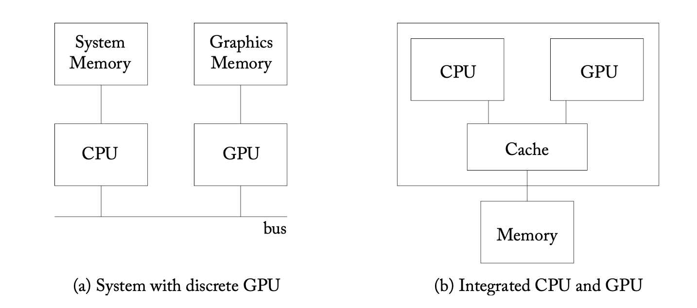
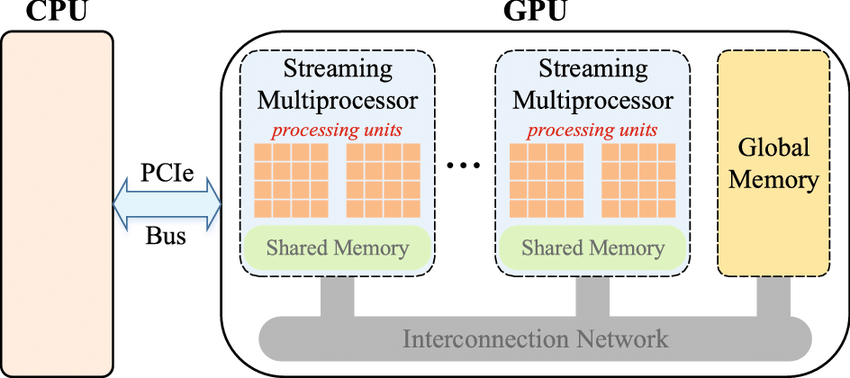

Before getting into TinyGrad, I want to make sure I understand GPU architecture at the most basic level, so this is the prelude to the series on TinyGrad. This section on GPUs comes from the book "General Purpose Graphics Processor Architecture".

Also, yes, I used Claude for some rewriting. All info is mine.

# Why are GPUs Essential for Deep Learning?

Imagine trying to paint a massive wall. You could use one expert painter with an intricate brush (like a CPU), or you could hand rollers to 100 people and get the job done in parallel (like a GPU). This is exactly why GPUs have revolutionized deep learning.

## The Perfect Match

Deep learning, at its core, is surprisingly simple. It's built on basic mathematical operations - dot products, matrix multiplications, and activation functions like ReLU - repeated billions of times. What makes it complex isn't any single operation, but the sheer scale at which these operations need to happen.

This is where GPUs excel. Unlike CPUs, which are designed to be jack-of-all-trades processors, GPUs are purpose-built for parallel processing. They excel at doing thousands of simple calculations simultaneously.

## Why Not Just Use Better CPUs?
We've hit some fundamental limits in CPU design:

- Transistors can't get much smaller (we're already working at nanometer scales)
- Clock speeds have largely plateaued (heat and power consumption become major issues)
- Single-core performance improvements are yielding diminishing returns

While CPU architects have developed impressive tricks to optimize performance - from branch prediction to out-of-order execution - they're ultimately constrained by their general-purpose architecture and limited number of (high-powered) cores. 

## The GPU Revolution
Enter GPUs, or Graphics Processing Units. Instead of relying on a few powerful cores like CPUs, GPUs take a different approach: they use hundreds or thousands of simpler cores working in parallel. Originally designed for rendering graphics (hence the name), these processors turned out to be perfect for deep learning's parallel workloads.

Think of it this way: If you need to multiply a million pairs of numbers:
- A CPU would do this very quickly... one at a time
- A GPU can handle hundreds or thousands of these multiplications simultaneously.

In other words, CPUs are race-cars; GPUs, buses.

## The CPU-GPU Partnership
While GPUs excel at parallel computation, they don't work alone. The CPU controls what the GPU does (assigning tasks and data), handles higher level program control flow, and manages I/O operations.

This division of labor makes sense: CPUs are built for versatility and can handle a wide range of tasks efficiently, while GPUs focus on doing one thing extremely well - parallel computation.

## Understanding GPU Types

GPUs come in two main flavors: Integrated GPUs and Discrete GPUs. Integrated GPUs share memory with the CPU. They're less powerful but more energy-efficient than discrete GPUs, making them a better choice for things like laptops. Discrete GPUs have their own high-speed graphics memory known as VRAM, and are typically significantly more powerful.

For deep learning applications, discrete GPUs are the clear choice. GPU memory is specifically designed for high throughput (as opposed to CPU memory's low latency), because deep learning workloads typically process large batches of data at once. When training neural networks, we don't need instant access to individual values - instead, we need to move massive chunks of data (like entire batches of images or feature maps) between memory and compute units as efficiently as possible.



## Flow of execution in a GPU program

GPU programs originate on the CPU, with all CPU-GPU interactions managed through a *driver* layer. This driver handles:

- GPU memory allocation at program initialization
- Loading and management of kernels (GPU-executable code)
- Thread configuration and scheduling
- Memory transfer between CPU and GPU
- Input data mapping for thread access

A kernel represents the fundamental unit of GPU code execution - the specific computational instructions that will be parallelized across thousands of GPU threads. Operations like matrix multiplication and convolution are implemented as specialized kernels optimized for parallel execution.

Unlike CPU cores that run one or two heavyweight threads, each GPU core executes a SIMT (Single Instruction, Multiple Thread) program where thousands of lightweight threads perform the same operation in lockstep. These threads execute identical instructions simultaneously, just on different data elements.

Each core contains a high-speed scratchpad memory, accessible only to its threads. This local memory enables rapid communication between threads, with hardware barrier operations ensuring synchronized access to prevent race conditions. Beyond this shared space, cores maintain instruction and data caches for frequently accessed information. This hierarchical memory structure serves a crucial purpose: keeping data as close to computation as possible, since processing speed is ultimately bounded by memory access time. No matter how fast your processor, you can't crunch numbers faster than you can feed them in.



# Programming Model of GPUS

To recap, this is the typical process of a GPU-accelerated program:

1. Program begins executing on CPU
2. Memory is allocated on GPU
3. Input data is transferred to GPU memory
4. Computational kernel is launched on the GPU

A common operation is `SAXPY`, AKA scalar * vector + vector. This is part of the Basic Linear Algebra Software (BLAS) library. The book provides traditional CPU C code alongisde a CUDA implementation.

```c
void saxpy_serial(int n, float a, float *x, float *y) {
 for (int i = 0; i < n; ++i)
 y[i] = a*x[i] + y[i];
}
main() {
 float *x, *y;
 int n;
 // omitted: allocate CPU memory for x and y and initialize contents
 saxpy_serial(n, 2.0, x, y); // Invoke serial SAXPY kernel
 // omitted: use y on CPU, free memory pointed to by x and y
}
```

```c
__global__ void saxpy(int n, float a, float *x, float *y) {
    int i = blockIdx.x*blockDim.x + threadIdx.x;
    if(i<n)
        y[i] a*x[i] + y[i];
}
int main() {
     float *h_x, *h_y;
     int n;
     // omitted: allocate CPU memory for h_x and h_y and initialize contents
     float *d_x, *d_y;
     int nblocks = (n + 255) / 256;
     cudaMalloc( &d_x, n * sizeof(float) );
     cudaMalloc( &d_y, n * sizeof(float) );
     cudaMemcpy( d_x, h_x, n * sizeof(float), cudaMemcpyHostToDevice );
     cudaMemcpy( d_y, h_y, n * sizeof(float), cudaMemcpyHostToDevice );
     saxpy<<<nblocks, 256>>>(n, 2.0, d_x, d_y);
     cudaMemcpy( h_x, d_x, n * sizeof(float), cudaMemcpyDeviceToHost );
     // omitted: use h_y on CPU, free memory pointed to by h_x, h_y, d_x, and d_y
}
```

SAXPY (Single-precision A·X Plus Y) operation provides a clear example of how GPU threads map to data, thus employing data-level parallelism. Each thread operates on a single scalar value, which it finds by determining its position within the GPU's hierarchical thread organization: threads are grouped into thread blocks, which together form a grid.

The <<<>>> syntax in our example defines blocks of 256 threads each. To find its corresponding data element, each thread combines its block's grid position (blockIdx.x * blockDim.x) with its position within the block (threadIdx.x). This mapping ensures each thread processes its unique piece of data in parallel.

I think this brief overview gives enough detail on parallel programming and GPU architecture for the next parts to make sense, so I'll leave it here. I would go into more detail on the CUDA code, but the details seem unecessary as I plan to focus on how TinyGrad works with Apple's Metal GPU interface.

Credit to [research gate](https://researchgate.com) for the GPU architecture image and the textbook for the discrete vs. integrated image.